# STYRS — Complete Project Architecture

> Solar Cell Defect Detection Platform using Deep Learning

---

## 1. System Overview

STYRS is a full-stack AI system that classifies solar cell images as **"Good"** or **"Defective"** using a deep learning model. The system spans four platforms:

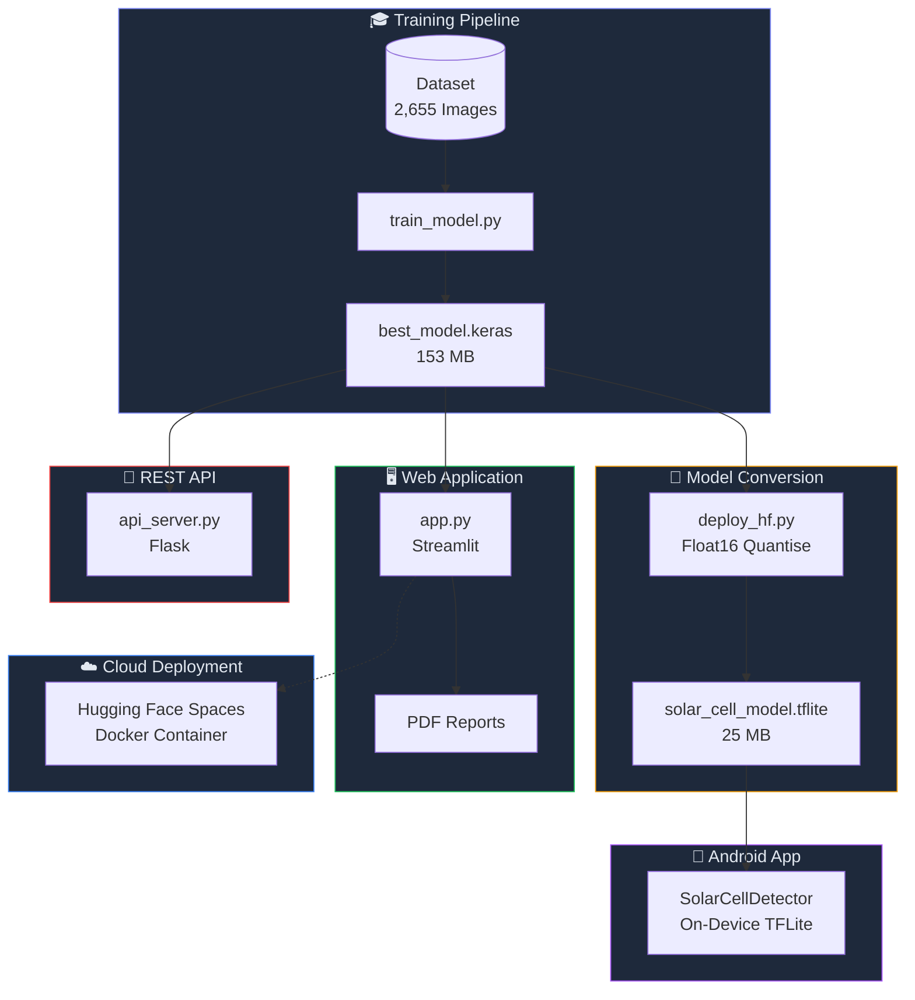

---

## 2. Project File Structure

```
STYRS/  (462 MB total)
│
├── ── Python Source Files ──────────────────────────────
├── app.py                          Streamlit web app (1,348 lines)
├── api_server.py                   Flask REST API server (233 lines)
├── train_model.py                  Model training script (486 lines)
├── predict_model.py                CLI prediction tool (182 lines)
├── deploy_hf.py                    HF deployment + TFLite conversion (124 lines)
│
├── ── AI Models ───────────────────────────────────────
├── best_model.keras                Trained EfficientNetB3 model (153 MB)
├── solar_cell_model.tflite         TFLite model for Android (25 MB)
│
├── ── Dataset ─────────────────────────────────────────
├── solar_data/
│   ├── train/
│   │   ├── Defective/              882 images
│   │   └── Good/                   1,237 images
│   └── test/
│       ├── Defective/              249 images
│       └── Good/                   286 images
│
├── ── Training Outputs ────────────────────────────────
├── confusion_matrix.png            Evaluation confusion matrix
├── training_history.png            Accuracy/loss curves
│
├── ── Cloud Deployment ────────────────────────────────
├── hf_deploy/
│   ├── app.py                      Streamlit app (cloud version, 514 lines)
│   ├── Dockerfile                  Docker config for HF Spaces
│   ├── requirements.txt            Python dependencies (cloud)
│   ├── best_model.keras            Model copy for cloud
│   ├── README.md                   HF Spaces metadata
│   └── .streamlit/config.toml      Streamlit config (port, CORS)
│
├── ── Android App ─────────────────────────────────────
├── STYRS-v3.0-debug.apk            Compiled Android APK (46 MB)
├── SolarCellDetector/
│   ├── app/
│   │   ├── build.gradle            Dependencies and SDK config
│   │   └── src/main/
│   │       ├── AndroidManifest.xml  App permissions and activities
│   │       ├── assets/
│   │       │   └── solar_cell_model.tflite   TFLite model (bundled)
│   │       ├── java/com/styrs/solarcell/
│   │       │   ├── ui/
│   │       │   │   ├── SplashActivity.kt     Animated launch screen
│   │       │   │   ├── MainActivity.kt       Camera/gallery + analyze
│   │       │   │   ├── ResultActivity.kt     Prediction display
│   │       │   │   ├── HistoryActivity.kt    Scan history list
│   │       │   │   └── SettingsActivity.kt   App configuration
│   │       │   ├── ml/
│   │       │   │   └── TFLiteClassifier.kt   On-device AI inference
│   │       │   ├── data/
│   │       │   │   ├── AppSettings.kt        SharedPreferences manager
│   │       │   │   └── ScanHistoryManager.kt Persistent history storage
│   │       │   └── api/
│   │       │       ├── ApiService.kt         Retrofit interface (legacy)
│   │       │       ├── PredictionResponse.kt JSON response models
│   │       │       └── RetrofitClient.kt     HTTP client (legacy)
│   │       └── res/
│   │           ├── layout/           6 XML layouts
│   │           ├── drawable/         11 vector/shape drawables
│   │           ├── values/           colors.xml, strings.xml, themes.xml
│   │           └── xml/              network_security, file_paths
│   ├── build.gradle                  Project-level Gradle config
│   ├── settings.gradle               Module settings
│   ├── gradle.properties             Gradle options
│   └── gradlew                       Gradle wrapper script
│
├── ── Documentation ───────────────────────────────────
├── README.md                       Project overview
├── ARCHITECTURE.md                 This file
└── requirements.txt                Python dependencies (local)
```

---

## 3. Deep Learning Pipeline

### 3.1 Dataset

| Split | Defective | Good | Total |
|-------|-----------|------|-------|
| Train | 882 | 1,237 | 2,119 |
| Test  | 249 | 286 | 535 |
| **Total** | **1,131** | **1,523** | **2,654** |

- **Source**: ELPV (Electroluminescence Photovoltaic) dataset
- **Image Type**: Electroluminescence images of monocrystalline/polycrystalline solar cells
- **Binary Classification**: Good (no defects) vs Defective (cracks, dark spots, inactive regions)

### 3.2 Model Architecture

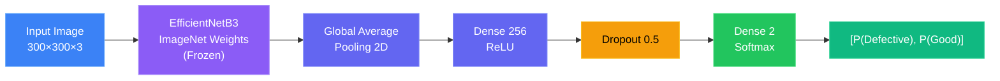

| Property | Value |
|----------|-------|
| Base Architecture | EfficientNetB3 (transfer learning) |
| Pre-trained Weights | ImageNet |
| Total Parameters | 13.3 million |
| Trainable Parameters | ~256 × 1280 + 256 + 2 × 256 + 2 ≈ 328K |
| Input Size | 300 × 300 × 3 |
| Output | Softmax [P(Defective), P(Good)] |
| Best Validation Accuracy | **89.24%** |
| Model File Size | 153 MB (.keras) |

### 3.3 Training Configuration

```
File: train_model.py (486 lines)
```

| Parameter | Value | Purpose |
|-----------|-------|---------|
| Optimizer | Adam | Adaptive learning rate optimisation |
| Learning Rate | 0.001 (initial) | Starting learning rate |
| Loss Function | Categorical Cross-Entropy | Standard for multi-class |
| Batch Size | 32 | Images per gradient step |
| Max Epochs | 20 | Upper limit (early stopping may cut short) |

### 3.4 Data Augmentation

Applied only to training images — test images use only rescaling.

| Transform | Range | Purpose |
|-----------|-------|---------|
| Rescale | ÷ 255 → [0, 1] | Normalise pixel values |
| Rotation | ±20° | Handle rotated cell placement |
| Width Shift | ±20% | Simulate horizontal misalignment |
| Height Shift | ±20% | Simulate vertical misalignment |
| Horizontal Flip | 50% chance | Double effective dataset size |
| Fill Mode | Nearest | Fill border gaps with nearest pixel |

### 3.5 Training Callbacks

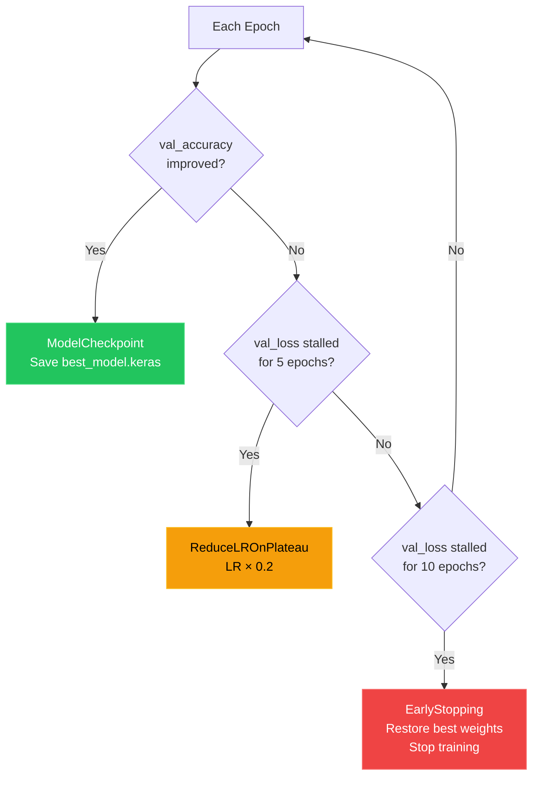

---

## 4. Model Conversion (Keras → TFLite)

```
File: deploy_hf.py (124 lines)
```

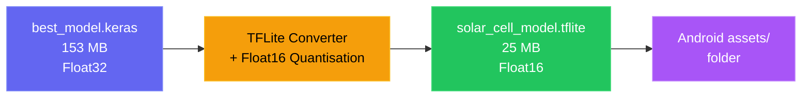

| Property | Keras Model | TFLite Model |
|----------|-------------|--------------|
| Format | .keras (HDF5) | .tflite (FlatBuffer) |
| Precision | Float32 | Float16 |
| Size | 153 MB | 25 MB |
| Reduction | — | **83.7%** smaller |
| Device | Server/PC | Mobile phone |

---

## 5. Web Application (Streamlit)

```
File: app.py (1,348 lines)
```

### 5.1 Architecture

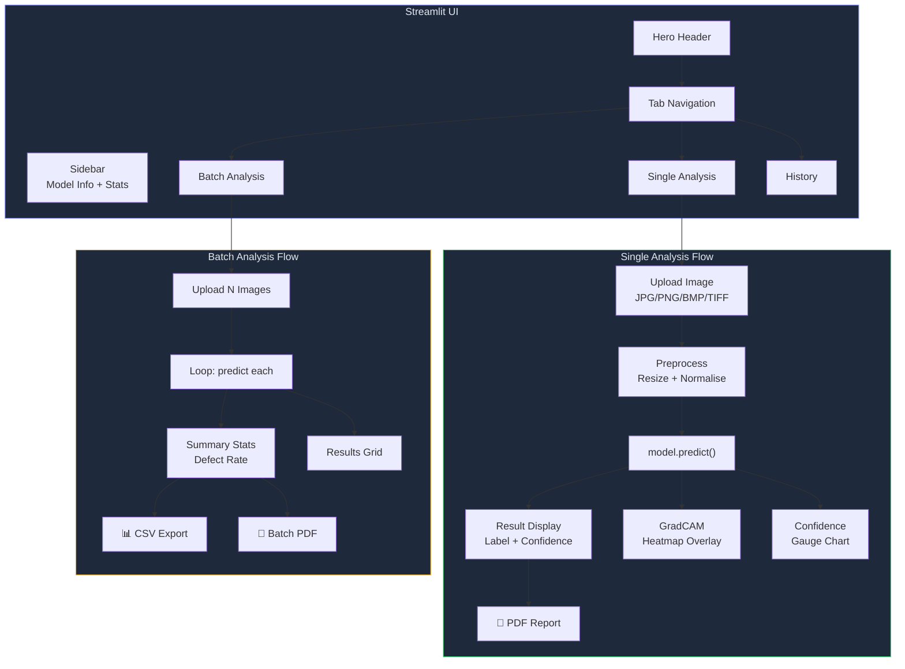

### 5.2 Key Functions

| Function | Lines | Purpose |
|----------|-------|---------|
| `load_trained_model()` | ~15 | Load .keras model (cached with `@st.cache_resource`) |
| `preprocess_image()` | ~10 | Resize + normalise image to [0,1] |
| `predict_single()` | ~15 | Run inference, return label + probabilities |
| `generate_gradcam()` | ~90 | GradCAM heatmap using GradientTape |
| `create_confidence_gauge()` | ~25 | Matplotlib polar chart (speedometer style) |
| `add_to_history()` | ~15 | Save scan to session state (max 50) |
| `generate_single_pdf()` | ~150 | Professional single-image PDF report |
| `generate_batch_pdf()` | ~130 | Batch summary PDF report with table |
| `detect_architecture()` | ~15 | Auto-detect model type from layer names |
| `get_model_input_size()` | ~5 | Extract (H, W) from model.input_shape |

### 5.3 UI Design

- **Design System**: Custom CSS (glassmorphism, gradients, dark theme)
- **Font**: Inter (Google Fonts)
- **Background**: 3-stop gradient (`#0f0c29 → #1a1a2e → #16213e`)
- **Cards**: Glass morphism (`rgba(255,255,255,0.05)` + backdrop blur)
- **Accent Colors**: Purple `#818cf8`, Green `#22c55e`, Red `#ef4444`

---

## 6. Flask REST API

```
File: api_server.py (233 lines)
```

### 6.1 Endpoints

| Method | Endpoint | Purpose | Input | Output |
|--------|----------|---------|-------|--------|
| `GET` | `/health` | Server health check | — | `{ status, model_loaded }` |
| `POST` | `/predict` | Classify image | `multipart/form-data` (image) | `{ predicted_class, confidence, probabilities }` |
| `GET` | `/classes` | List class names | — | `{ classes: ["Defective", "Good"] }` |

### 6.2 Request/Response Example

```
POST /predict
Content-Type: multipart/form-data
Body: image=<solar_cell.jpg>

Response (200 OK):
{
  "success": true,
  "predicted_class": "Defective",
  "confidence": 0.923,
  "probabilities": {
    "defective": 0.923,
    "good": 0.077
  }
}
```

### 6.3 Configuration

| Setting | Value |
|---------|-------|
| Host | 0.0.0.0 |
| Port | 5001 |
| CORS | Enabled (all origins) |
| Model | best_model.keras (loaded at startup) |

---

## 7. Cloud Deployment (Hugging Face Spaces)

```
Directory: hf_deploy/ (6 files)
Live URL: https://huggingface.co/spaces/jayaram060504/styrs-solar-inspector
```

### 7.1 Architecture

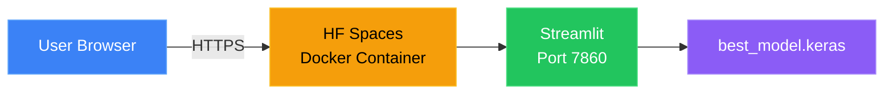

### 7.2 Docker Configuration

```dockerfile
FROM python:3.11-slim
WORKDIR /app
COPY requirements.txt .
RUN pip install --no-cache-dir -r requirements.txt
COPY . .
EXPOSE 7860
ENTRYPOINT ["streamlit", "run", "app.py",
  "--server.port=7860",
  "--server.address=0.0.0.0",
  "--server.headless=true",
  "--server.enableCORS=false",
  "--server.enableXsrfProtection=false"]
```

### 7.3 Key Differences from Local Version

| Feature | Local (`app.py`) | Cloud (`hf_deploy/app.py`) |
|---------|-----------------|---------------------------|
| Port | 8501 (default) | 7860 (HF requirement) |
| CORS | Default | Disabled (proxy handles it) |
| XSRF Protection | Default | Disabled (HF proxy conflict) |
| Model Path | `./best_model.keras` | `./best_model.keras` (bundled) |

---

## 8. Android Application

```
Directory: SolarCellDetector/ (11 Kotlin files, 1,680 lines)
APK: STYRS-v3.0-debug.apk (46 MB)
```

### 8.1 App Flow

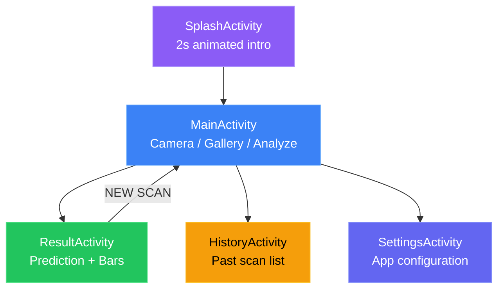

### 8.2 Package Structure

```
com.styrs.solarcell/
├── ui/                          User Interface (5 Activities)
│   ├── SplashActivity.kt       Animated launch screen (84 lines)
│   ├── MainActivity.kt         Central hub — camera, gallery, analyze (448 lines)
│   ├── ResultActivity.kt       Animated result display (195 lines)
│   ├── HistoryActivity.kt      RecyclerView of past scans (177 lines)
│   └── SettingsActivity.kt     App configuration screen (106 lines)
│
├── ml/                          Machine Learning
│   └── TFLiteClassifier.kt     On-device TFLite inference engine (230 lines)
│
├── data/                        Data Persistence
│   ├── AppSettings.kt          SharedPreferences wrapper (116 lines)
│   └── ScanHistoryManager.kt   JSON-based scan history (122 lines)
│
└── api/                         Network (Legacy — unused in v3.0)
    ├── ApiService.kt            Retrofit HTTP interface (42 lines)
    ├── PredictionResponse.kt    JSON response models (81 lines)
    └── RetrofitClient.kt        OkHttp + Retrofit client (79 lines)
```

### 8.3 On-Device Inference Pipeline

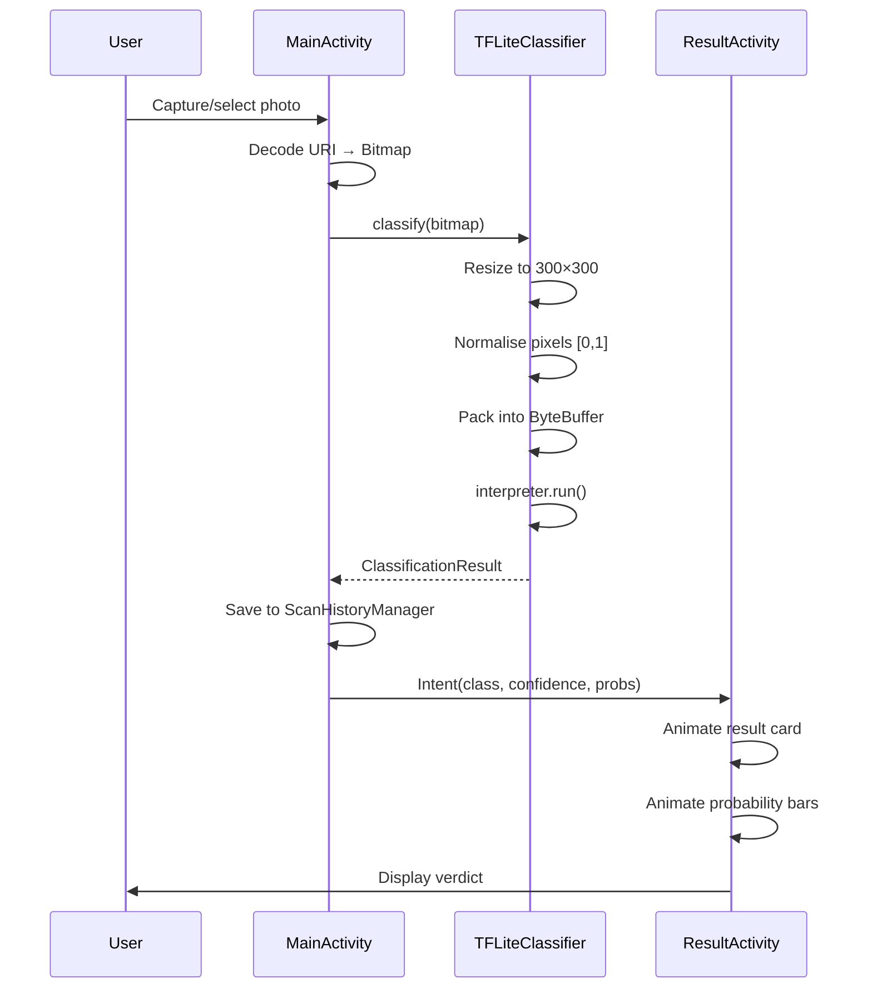

### 8.4 TFLite Classifier Details

| Property | Value |
|----------|-------|
| Model File | `assets/solar_cell_model.tflite` |
| Loading Method | Memory-mapped (zero-copy) |
| Input Shape | `[1, 300, 300, 3]` Float32 |
| Output Shape | `[1, 2]` Float32 |
| Inference Threads | 4 CPU threads |
| Pixel Normalisation | R,G,B each ÷ 255.0 |
| Class Labels | `["Defective", "Good"]` |

### 8.5 Android Dependencies

| Library | Version | Purpose |
|---------|---------|---------|
| TensorFlow Lite | 2.16.1 | On-device ML inference |
| Retrofit | 2.11.0 | HTTP client (legacy) |
| Gson | 2.11.0 | JSON parsing |
| OkHttp | 4.12.0 | HTTP transport (legacy) |
| Coil | 2.7.0 | Async image loading |
| Coroutines | 1.9.0 | Async/concurrent operations |
| Material Design | 1.12.0 | UI components |

### 8.6 Android Build Configuration

| Property | Value |
|----------|-------|
| Min SDK | 24 (Android 7.0 Nougat) |
| Target SDK | 35 (Android 15) |
| Compile SDK | 35 |
| Java Version | 17 |
| Gradle Version | 9.3.1 |
| AGP Version | 9.0.1 |
| Version Name | 3.0 |
| APK Size | 46 MB |

---

## 9. Data Flow Diagrams

### 9.1 Training Flow

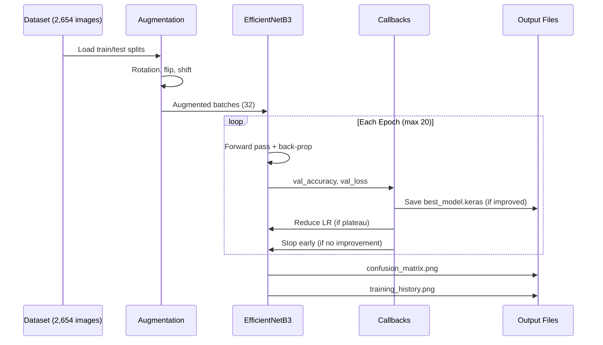

### 9.2 Web Inference Flow

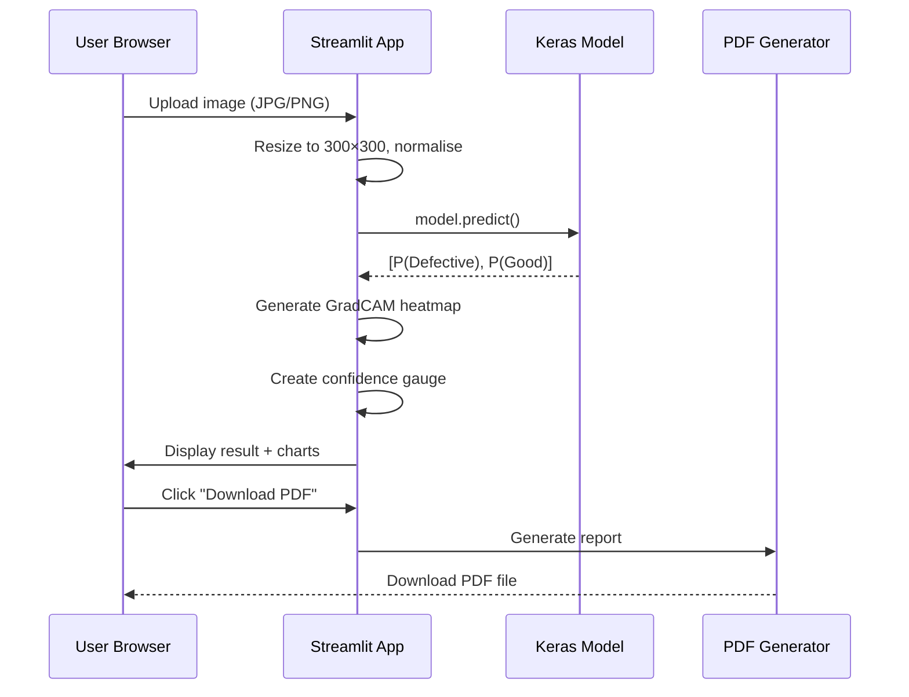

### 9.3 Mobile Inference Flow

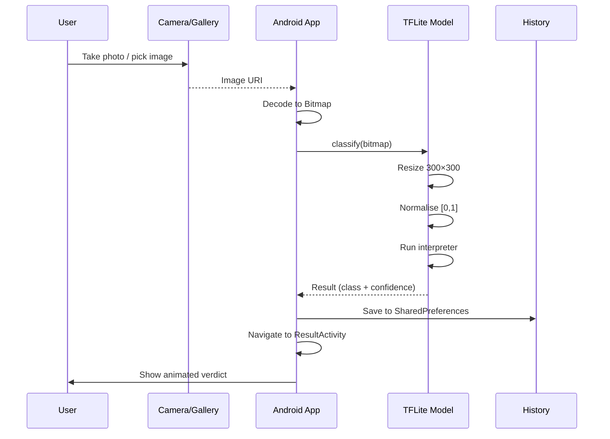

---

## 10. Technology Stack Summary

### 10.1 Python Dependencies

| Package | Version | Used By |
|---------|---------|---------|
| TensorFlow | ≥ 2.15.0 | Model training, inference, GradCAM |
| Streamlit | ≥ 1.30.0 | Web UI framework |
| Flask | ≥ 3.0.0 | REST API server |
| Flask-CORS | ≥ 4.0.0 | Cross-origin requests |
| NumPy | ≥ 1.24.0 | Array operations |
| Pandas | ≥ 2.0.0 | CSV export |
| Matplotlib | ≥ 3.7.0 | Confidence gauge, training plots |
| Seaborn | ≥ 0.12.0 | Confusion matrix heatmap |
| Scikit-learn | ≥ 1.3.0 | Classification report |
| Pillow | ≥ 10.0.0 | Image manipulation |
| FPDF2 | ≥ 2.7.0 | PDF report generation |
| Gunicorn | ≥ 21.2.0 | Production WSGI server |

### 10.2 Code Statistics

| Component | Language | Files | Lines |
|-----------|----------|-------|-------|
| Web App | Python | 1 | 1,348 |
| Cloud App | Python | 1 | 514 |
| Training | Python | 1 | 486 |
| API Server | Python | 1 | 233 |
| Prediction CLI | Python | 1 | 182 |
| Deployment | Python | 1 | 124 |
| Android UI | Kotlin | 5 | 1,010 |
| Android ML | Kotlin | 1 | 230 |
| Android Data | Kotlin | 2 | 238 |
| Android API | Kotlin | 3 | 202 |
| **Total** | **—** | **17** | **4,567** |

---

## 11. Security & Configuration

### 11.1 Android Permissions

| Permission | Purpose |
|------------|---------|
| `CAMERA` | Capture solar cell photos |
| `READ_MEDIA_IMAGES` | Access gallery (Android 13+) |
| `READ_EXTERNAL_STORAGE` | Access gallery (Android < 13) |
| `INTERNET` | Legacy API fallback |

### 11.2 Android Security Config

- **Network Security**: Cleartext traffic allowed for local development (`network_security_config.xml`)
- **FileProvider**: Secure camera photo sharing between apps (`file_paths.xml`)
- **TFLite**: Model file is not compressed in the APK (`aaptOptions { noCompress "tflite" }`)

### 11.3 Cloud Security

- **CORS**: Disabled at Streamlit level (HF proxy handles it)
- **XSRF**: Disabled at Streamlit level (HF proxy conflict)
- **HTTPS**: Enforced by HF Spaces reverse proxy

---

## 12. Performance Metrics

| Metric | Value |
|--------|-------|
| Model Accuracy | 89.24% (validation) |
| Model Size (Keras) | 153 MB |
| Model Size (TFLite) | 25 MB (83.7% reduction) |
| APK Size | 46 MB |
| Web App Inference | ~1-2s per image |
| Mobile Inference | ~0.5-1s per image |
| Python Code | 2,887 lines |
| Kotlin Code | 1,680 lines |
| Total Code | 4,567 lines |
| Dataset Size | 2,654 images |
| Supported Formats | JPG, PNG, BMP, TIFF |

---

## 13. How to Run Each Component

### 13.1 Web App (Local)
```bash
pip install -r requirements.txt
streamlit run app.py
# Opens at http://localhost:8501
```

### 13.2 Flask API
```bash
python api_server.py
# Runs at http://localhost:5001
# Test: curl http://localhost:5001/health
```

### 13.3 Training
```bash
python train_model.py --data_dir ./solar_data --epochs 20
# Saves best_model.keras, training_history.png, confusion_matrix.png
```

### 13.4 CLI Prediction
```bash
python predict_model.py --image_path path/to/image.jpg
```

### 13.5 Android App
```
Transfer STYRS-v3.0-debug.apk to Android phone → Install → Open
No server connection needed (on-device AI)
```

### 13.6 Cloud (Already Deployed)
```
https://huggingface.co/spaces/jayaram060504/styrs-solar-inspector
```
